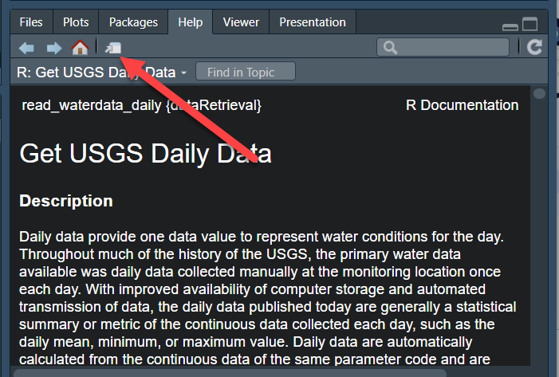
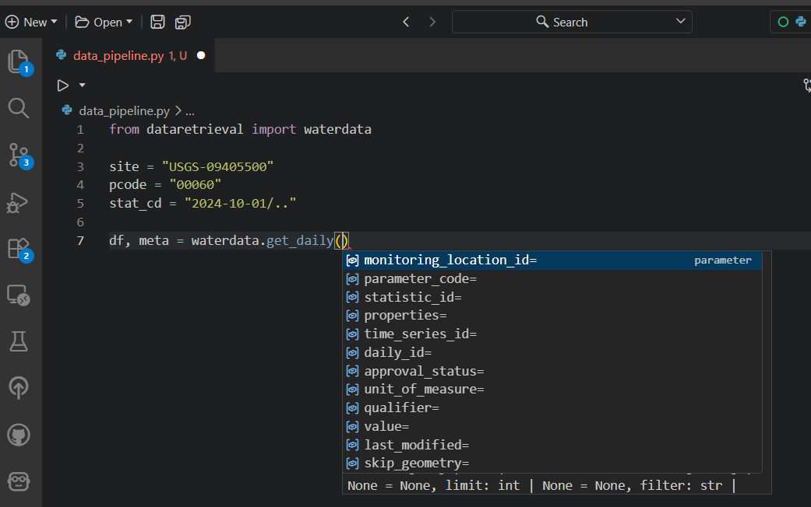
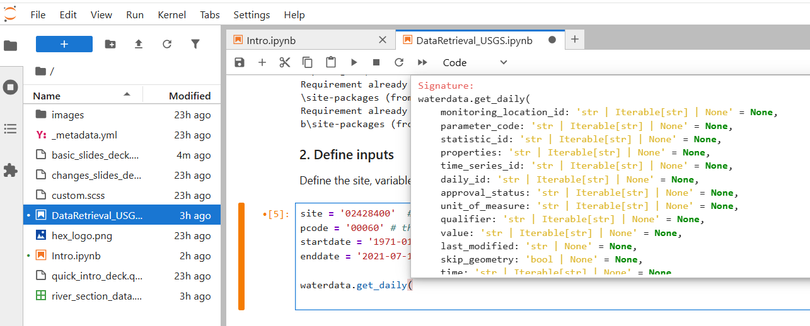

```{r}
#| echo: false
#| include: false
# library(dataRetrieval)
library(ggplot2)
library(dplyr)
library(reticulate)

py_require("dataretrieval")
py_require("panda")
py_require("matplotlib")
py_require("geopandas")
py_require("folium")
py_require("mapclassify")
options(dplyr.summarise.inform = FALSE)

theme_set(theme_bw(base_size = 20))
update_geom_defaults("point", list(size = 3, color = "steelblue"))
options(ggplot2.discrete.colour = "viridis")

evaluate_python <- params$run_python

dt_me <- function(
  x,
  page_length = 8,
  paging = TRUE,
  font = "0.7em",
  escape = TRUE
) {
  DT::datatable(
    x,
    rownames = FALSE,
    options = list(
      pageLength = page_length,
      info = FALSE,
      searching = FALSE,
      paging = paging,
      lengthChange = FALSE,
      initComplete = htmlwidgets::JS(
        "function(settings, json) {",
        paste0(
          "$(this.api().table().container()).css({'font-size': '",
          font,
          "'});"
        ),
        "}"
      )
    ),
    escape = escape
  )
}
```


## Introduction {background-image="images/hex_logo.png" background-size="15%" background-position="90% 90%" }

The goal of these slides are to:

- Introduce the modern USGS water data concepts

- Introduce basic `dataretrieval` workflows (R and Python)

- Introduce additional topics that often come up
  
## Software Installation

::: {.panel-tabset}

### R

`dataRetrieval` is available on the Comprehensive R Archive Network (CRAN) repository. To install `dataRetrieval` on your computer, open RStudio and run this line of code in the Console:

```{r}
#| echo: true
#| eval: false
install.packages("dataRetrieval")
```

Then each time you open R, you'll need to load the library:

```{r}
#| message: true
library(dataRetrieval)
```

### Python

Whether you are a user or developer we recommend installing `dataretrieval` in a virtual environment. This can be done using something like virtualenv or conda. 

```{bash}
#| echo: true
#| eval: false
pip install dataretrieval
```

or

```{bash}
#| echo: true
#| eval: false
conda install conda-forge::dataretrieval
```

Then each time you open Python, you'll need to load the library:

```{python}
#| eval: !expr evaluate_python
from dataretrieval import waterdata
```

:::

::: footer

:::


## External Documentation

- R package: <https://doi-usgs.github.io/dataRetrieval/>

- Python package: <https://doi-usgs.github.io/dataretrieval-python/>

- WDFN Blog: <https://waterdata.usgs.gov/blog/>

## Internal Documentation {.smaller}

::: {.panel-tabset}

### R

Within R, you can call help files for any `dataRetrieval` function:

```{r}
#| echo: true
#| eval: false
?read_waterdata_daily
```

:::: {.columns}

::: {.column width="50%"}

Click here to open a new window in RStudio:




:::

::: {.column width="50%"}

Scroll down to the "Examples" to see how each function can be run.

Examples

```{r}
#| eval: false
site <- "USGS-02238500"
dv_data_sf <- read_waterdata_daily(
  monitoring_location_id = site,
  parameter_code = "00060",
  time = c("2021-01-01", "2022-01-01")
)
```

:::

::::

### Python

Within Python, you can call help for any `dataretrieval` function:

```{python}
#| eval: !expr evaluate_python
help(waterdata.get_daily)
```

:::


::: footer

:::

## USGS Water Data Concepts {.smaller}

:::: {.columns}

::: {.column width="50%"}
**USGS Water Data APIs**

- Continuous (e.g. 15-minute sensor data)
  
- Daily (e.g. mean from continuous)
    
- Monitoring Location Information

- Time Series Information

- Latest Daily/Continuous

- Field Measurements

:::

::: {.column width="50%"}
**USGS Water Data APIs**
   
- Peak Flows

- Rating Curves

- Discrete Water-Quality

**Water Quality Portal (WQP) Data**
  
- Discrete water-quality data (USGS & others)

:::

::::

::: {.callout-important}
## Each of these is has a different:

* API endpoint
* `dataRetrieval` function
* Output format
:::


::: footer

:::

## USGS Basic Retrievals {.smaller}

The USGS uses various codes for basic retrievals. These codes can have leading zeros, therefore they need to be a character surrounded in quotes ("00060").

* Site ID (often 8 or 15-digits)
* Parameter Code (5 digits)
    + Full list: `read_metadata("parameter-codes")`
* Statistic Code (for daily values)
    + Full list: `read_metadata("statistic-codes")`

## USGS Basic Retrievals Parameter and Statistic Codes

Here are some examples of a few common codes:


```{r echo=FALSE, eval=TRUE}
library(knitr)

df <- data.frame(
  pCode = c("00060", "00065", "00010", "00400"),
  shName = c("Discharge", "Gage Height", "Temperature", "pH")
)

names(df) <- c("Parameter Code", "Short Name")

df2 <- data.frame(
  pCode = c("00001", "00002", "00003", "00008"),
  shName = c("Maximum", "Minimum", "Mean", "Median")
)

names(df2) <- c("Statistic Code", "Short Name")

knitr::kable(list(df, df2))
```

## `dataRetrieval` can help!

::: {.panel-tabset}

### R

```{r}
#| eval: false
parameter_codes <- read_waterdata_metadata("parameter-codes")
statistic_codes <- read_waterdata_metadata("statistic-codes")
# Others:
agency_codes <- read_waterdata_metadata("agency-codes")
aquifer_codes <- read_waterdata_metadata("aquifer-codes")
aquifer_types <- read_waterdata_metadata("aquifer-types")
coordinate_datum_codes <- read_waterdata_metadata("coordinate-datum-codes")
huc_codes <- read_waterdata_metadata("hydrologic-unit-codes")
national_aquifer_codes <- read_waterdata_metadata("national-aquifer-codes")
reliability_codes <- read_waterdata_metadata("reliability-codes")
site_types <- read_waterdata_metadata("site-types")
topographic_codes <- read_waterdata_metadata("topographic-codes")
time_zone_codes <- read_waterdata_metadata("time-zone-codes")
counties <- read_waterdata_metadata("counties")
states <- read_waterdata_metadata("states")
```

### Python

```{python}
#| eval: false
parameter_codes = waterdata.get_reference_table("parameter-codes")
statistic_codes = waterdata.get_reference_table("statistic-codes")
# Others:
agency_codes = waterdata.get_reference_table("agency-codes")
aquifer_codes = waterdata.get_reference_table("aquifer-codes")
aquifer_types = waterdata.get_reference_table("aquifer-types")
coordinate_datum_codes = waterdata.get_reference_table("coordinate-datum-codes")
huc_codes = waterdata.get_reference_table("hydrologic-unit-codes")
national_aquifer_codes = waterdata.get_reference_table("national-aquifer-codes")
reliability_codes = waterdata.get_reference_table("reliability-codes")
site_types = waterdata.get_reference_tablea("site-types")
topographic_codes = waterdata.get_reference_table("topographic-codes")
time_zone_codes = waterdata.get_reference_table("time-zone-codes")
counties = waterdata.get_reference_table("counties")
states = waterdata.get_reference_table("states")
```

::: {style="font-size: 50%;"}
Each function returns a Tuple, containing a dataframe and a Metadata class.
:::

:::

::: footer

:::


## Exercise 1: Orientation

::: {.panel-tabset}

### Challenge 

1. Open your preferred IDE (RStudio, VSCode, PyCharm, etc) or Jupyter notebook

2. Install `dataRetrieval` (R) or `dataretrieval` (Python) if you haven't already.

3. Load `dataRetrieval` (R) / waterdata module in `dataretrieval` (Python)

4. Open the help file for the function `read_waterdata_daily`


### R

```{r}
#| eval: false
install.packages(c("dataRetrieval"))
library(dataRetrieval)
?read_waterdata_daily
```

### Python

```{bash}
#| echo: true
#| eval: false
pip install dataretrieval
```


```{python}
#| eval: false
from dataretrieval import waterdata

help(waterdata.get_daily)
```


:::

::: footer

:::


## USGS Water Data API Token 

* The Water Data APIs limit how many queries a single IP address can make per hour

* You **can** run new `dataRetrieval` functions without a token

* You **might** run into errors quickly. If you (or your IP!) have exceeded the quota, you will see:

```
! HTTP 429 Too Many Requests.
  • You have exceeded your rate limit. Make sure you provided your API key from https://api.waterdata.usgs.gov/signup/, then either try again later or contact us at https://waterdata.usgs.gov/questions-comments/?referrerUrl=https://api.waterdata.usgs.gov for assistance.
```

## USGS Water Data API Token 

1. Request a USGS Water Data API Token: <https://api.waterdata.usgs.gov/signup/>

2. Save it in a safe place (KeyPass or other password management tool)

3. Add it as environment variable

4. Restart 

See next slide for a demonstration.

::: footer

:::

## Water Data API Token: Example {.smaller}

Let's pretend the token sent you was "abc123"

::: {.panel-tabset}

### R

1. Run in R:
```{r}
#| echo: true
#| eval: false
usethis::edit_r_environ()
```

2. Add this line to the file that opens up:

```
API_USGS_PAT = "abc123"
```

3. Save that file

4. Restart R/RStudio.

5. Check that it worked by running (you should see your token printed in the Console):

```{r}
#| eval: false
Sys.getenv("API_USGS_PAT")
```

::: {.callout-note collapse="true"}
Your .Renviorn file should never be pushed to a public repository.
:::

### Python

1. Create a file in your working directory .env

2. Add this line to the .env file:

```
API_USGS_PAT = "abc123"
```
4. Restart your python session

5. Check that it worked by running (you should see your token printed in the Console):

```{python}
#| echo: true
#| eval: false
import os
os.getenv("API_USGS_PAT")
'abc123'
```

::: {.callout-note collapse="true"}
Your .env file should never be pushed to a public repository.
:::

:::

::: footer

:::


## Water Data APIs: Initial Tips 

Use your "tab" key!

::: {.panel-tabset}

### R


### Python

{width="60%"}


### Jupyter Lab

Shift + Tab:

{width="60%"}

:::

::: footer

:::

## Water Data API Notes: Arguments 

* When you look at the help file for the new functions, you’ll notice there are lots of possible inputs parameters. 

* You **DO NOT** need to (and should not!) specify **all** of these parameters. 

* However, also consider what happens if you leave too many things blank. What do you suppose will be returned here?

```{r}
#| eval: false
#| echo: true
discharge <- read_waterdata_daily(
  parameter_code = "00060",
  statistic_id = "00003"
)
```

::: {.fragment}

::: {style="font-size: 50%;"}

Since no list of sites or bounding box was defined, **ALL** the daily data in **ALL** the country with parameter code "00060" and statistic code "00003" will be returned.

:::

:::

::: footer

:::


## Water Data API Notes: time input {.smaller}

:::: {.columns}

::: {.column width="50%"}

Time parameters have a few options:

* A single date (or date-time): "2024-10-01" or "2024-10-01T23:20:50Z"

* A bounded interval: c("2024-10-01", "2025-07-02")

* Half-bounded intervals: c("2024-10-01", NA)

* Duration objects: "P1M" for data from the past month or "PT36H" for the last 36 hours

:::

::: {.column width="50%"}

Here are a bunch of valid inputs:

::: {.panel-tabset}

### R

```{r}
#| code-line-numbers: "1-9|10-11|12-15|16-19"
# Ask for exact times:
time = "2025-01-01"
time = as.Date("2025-01-01")
time = "2025-01-01T23:20:50Z"
time = as.POSIXct(
  "2025-01-01T23:20:50Z",
  format = "%Y-%m-%dT%H:%M:%S",
  tz = "UTC"
)
# Ask for specific range
time = c("2024-01-01", "2025-01-01") # or Dates or POSIXs
# Asking beginning of record to specific end:
time = c(NA, "2024-01-01") # or Date or POSIX
# Asking specific beginning to end of record:
time = c("2024-01-01", NA) # or Date or POSIX
# Ask for period
time = "P1M" # past month
time = "P7D" # past 7 days
time = "PT12H" # past hours
```

### Python

```{python}
#| code-line-numbers: "1-2|3-4|5-6|7-8|9-12"
# Ask for exact times:
time = "2025-01-01"
# Ask for specific range
time = "2025-01-01/2026-01-01"
# Asking beginning of record to specific end:
time = "../2024-01-01"  # or Date or POSIX
# Asking specific beginning to end of record:
time = "2024-01-01/.."  # or Date or POSIX
# Ask for period
time = "P1M"  # past month
time = "P7D"  # past 7 days
time = "PT12H"  # past hours
```


:::

:::

::::

## Let's Go! 

* **Workflow 1**: Find Available Sites

* **Workflow 2**: Find Available Data
  
* **Workflow 3**: Get Latest Data

* **Workflow 4**: Get All Data


## Workflow 1: Find Available Sites

Let's get all the monitoring locations for Dane County, Wisconsin:

::: {.panel-tabset}

### R

```{r}
#| message: false
site_info <- read_waterdata_monitoring_location(
  state_name = "Wisconsin",
  county_name = "Dane County"
)
```

### Python

```{python}
#| eval: !expr evaluate_python

site_info, md = waterdata.get_monitoring_locations(
    state_name="Wisconsin", county_name="Dane County"
)
```

:::


::: {.callout-note collapse="true"}
## Note on county names
`read_waterdata_monitoring_location` requires "County" in the county_name argument. You can check county names using:
```{r}
#| eval: false
counties <- check_waterdata_sample_params(service = "counties")
```
:::

::: footer

:::

## site_info {.smaller .scrollable}

```{r}
#| echo: false
dt_me(site_info, 5, "0.6em")
```

::: footer

:::

## site_info_refined {.smaller}

Now that we've seen the whole data set, maybe we realize in the future we can ask for just stream sites, and we only really need a few of those columns:

::: {.panel-tabset}

### R

```{r}
#| message: true
site_info_refined <- read_waterdata_monitoring_location(
  state_name = "Wisconsin",
  county_name = "Dane County",
  site_type = "Stream",
  properties = c(
    "monitoring_location_id",
    "monitoring_location_name",
    "drainage_area",
    "geometry"
  )
)
```

### Python

```{python}
#| eval: !expr evaluate_python
site_info_refined, md = waterdata.get_monitoring_locations(
    state_name="Wisconsin",
    county_name="Dane County",
    site_type="Stream",
    properties=[
        "monitoring_location_id",
        "monitoring_location_name",
        "drainage_area",
        "geometry",
    ],
)
```

:::

::: footer

:::

## Map with geometry {.smaller}

::: {.panel-tabset}

### R: ggplot2

```{r}
#| output-location: default
library(ggplot2)

ggplot(data = site_info_refined) +
  geom_sf()
```

### Python: matplotlib

```{python}
#| eval: !expr evaluate_python
import matplotlib.pyplot as plt
import geopandas as gpd

site_info_refined.plot()

```

:::

::: footer

:::

## Interactive Leaflet Map

::: {.panel-tabset}

### R

```{r}
#| eval: true
#| output-location: slide
library(leaflet)
#default leaflet crs:
leaflet_crs <- "+proj=longlat +datum=WGS84"

leaflet(
  data = site_info_refined |>
    sf::st_transform(crs = leaflet_crs)
) |>
  addProviderTiles("CartoDB.Positron") |>
  addCircleMarkers(popup = ~monitoring_location_name, radius = 3, opacity = 1)
```

### Python

If you have `geopandas` installed, the function will return a GeoDataFrame with a geometry column containing the monitoring locations’ coordinates. You can use `gpd.explore()` to view your geometry coordinates on an interactive map. 

```{python}
#| eval: false
site_info_refined.set_crs(crs="WGS84").explore(
    marker_kwds=dict(radius=7),
    style_kwds=dict(opacity=1, fillOpacity=1),
    tiles="CartoDB.Positron",
)
```

:::

::: footer

:::

## Workflow 2: Find Available Data

Let's get all the time series in Dane County, WI with daily mean (statistic_id = "00003") discharge (parameter code = "00060") or temperature (parameter code = "00010"). 

::: {.panel-tabset}

### R

```{r}
sites_available <- read_waterdata_combined_meta(
  state_name = "Wisconsin",
  county_name = "Dane County",
  parameter_code = c("00060", "00010"),
  statistic_id = c("00003")
)
```

### Python

```{python}
sites_available, md = waterdata.get_combined_metadata(
  state_name = "Wisconsin",
  county_name = "Dane County",
  parameter_code = ["00060", "00010"],
  statistic_id = "00003"
)

```

:::

## sites_available {.smaller .scrollable}

Selecting just a few columns:

```{r}
#| echo: false
dt_me(
  sites_available |>
    sf::st_drop_geometry() |>
    filter(!is.na(begin)) |> # public, but "grade" set to unusable
    select(monitoring_location_id, parameter_name, parameter_code, begin, end),
  6,
  "0.7em"
)
```

## Workflow 3: Get Latest Data {.smaller}

Let's get the daily discharge measurements in Dane County, WI (parameter code = "00060") that have measured data in the last 14 days. 

::: {.panel-tabset}

### R

```{r}
latest_sites <- read_waterdata_combined_meta(
  state_name = "Wisconsin",
  county_name = "Dane County",
  parameter_code = c("00060"),
  last_modified = "P14D",
  data_type = "Continuous values"
)

latest_discharge <- read_waterdata_latest_continuous(
  monitoring_location_id = latest_sites$monitoring_location_id,
  parameter_code = "00060"
)
```

### Python

```{python}
latest_sites, md = waterdata.get_combined_metadata(
  state_name = "Wisconsin",
  county_name = "Dane County",
  parameter_code = "00060",
  last_modified = "P14D",
  data_type = "Continuous values"
)

latest_discharge, md = waterdata.get_latest_continuous(
  monitoring_location_id = latest_sites.monitoring_location_id,
  parameter_code = "00060"
)
```

:::

::: footer

:::

## Workflow 3: Get Latest Data {.smaller}

::: {.panel-tabset}

### R

```{r}
#| eval: false
pal <- colorNumeric("viridis", latest_discharge$value)

leaflet(
  data = latest_discharge |>
    sf::st_transform(crs = leaflet_crs)
) |>
  addProviderTiles("CartoDB.Positron") |>
  addCircleMarkers(
    popup = paste(
      latest_discharge$monitoring_location_id,
      "<br>",
      latest_discharge$time,
      "<br>",
      latest_discharge$value,
      latest_discharge$unit_of_measure
    ),
    color = ~ pal(value),
    radius = 3,
    opacity = 1
  ) |>
  addLegend(
    pal = pal,
    position = "bottomleft",
    title = "Latest Discharge",
    values = ~value
  )
```

### Python

```{python}
#| eval: true
#| output-location: slide

latest_discharge.set_crs(crs="WGS84").explore(
    marker_kwds=dict(radius=7),
    style_kwds=dict(opacity=1, fillOpacity=1),
    tiles="CartoDB.Positron",
    column="value",
    cmap="viridis",
    zoom_start=10,
)
```

:::

::: footer

:::


## Workflow 4: Get All Data

Let's get daily discharge data for the last 3 years from 2 sites:

::: {.panel-tabset}

### R

```{r}
daily <- read_waterdata_daily(
  monitoring_location_id = c("USGS-05406457", "USGS-05427930"),
  parameter_code = c("00060"),
  statistic_id = "00003",
  time = c("2022-10-01", "2025-10-01")
)
```

### Python

```{python}
df, md = waterdata.get_daily(
    monitoring_location_id= ["USGS-05406457", "USGS-05427930"],
    parameter_code="00060",
    statistic_id="00003",
    time="2022-10-01/2025-10-01",
)
```

:::

## Workflow 4: Get All Data: Plot It {.smaller}

::: {.panel-tabset}

### R

```{r}
ggplot(data = daily) +
  geom_line(aes(x = time, y = value, color = approval_status)) +
  facet_grid(monitoring_location_id ~ ., )
```

### Python

```{python}
#| eval: true
import matplotlib.pyplot as plt
import pandas as pd
import seaborn

levels, categories = pd.factorize(df["approval_status"])
graph = seaborn.FacetGrid(
    df, row="monitoring_location_id", hue="approval_status", height=3, aspect=5
)
graph.map(plt.scatter, "time", "value").add_legend()
```

:::

::: footer

:::

## Workflow 5: Get Discrete Water Quality Data

## USGS Samples Data Notes: Data Types and Profiles 

* There are 2 arguments that dictate what kind of data is returned
  - "dataType"  defines what kind of data comes back
  - "dataProfile" defines what columns from that type come back


## More Information {.smaller}

- dataRetrieval R repository:
  - <https://github.com/DOI-USGS/dataRetrieval>
  - [Documentation](https://doi-usgs.github.io/dataRetrieval)
  - [dataRetrieval New Features](https://doi-usgs.github.io/dataRetrieval/articles/read_waterdata_functions.html)

- dataretrieval Python repository:
  - <https://github.com/DOI-USGS/dataretrieval-python>
  - [Documentation](https://doi-usgs.github.io/dataretrieval-python/)

- Contact:
  - Computational Tools Email: comptools@usgs.gov

:::: footer 

::: {style="font-size: 80%;"}

Any use of trade, firm, or product name is for descriptive purposes only and does not imply endorsement by the U.S. Government.
:::

::::

